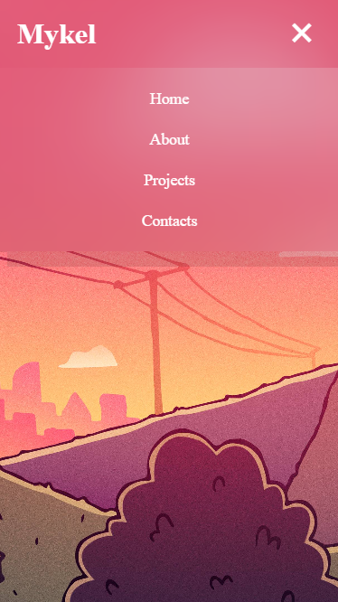

# Responsive Navbar Project

This project features a simple, responsive navigation bar built using HTML and CSS. The navigation bar adjusts seamlessly between desktop and mobile views, ensuring a user-friendly experience on all devices.

## Preview

### Desktop View

### Mobile View (Collapsed)

### Mobile View (Expanded)
